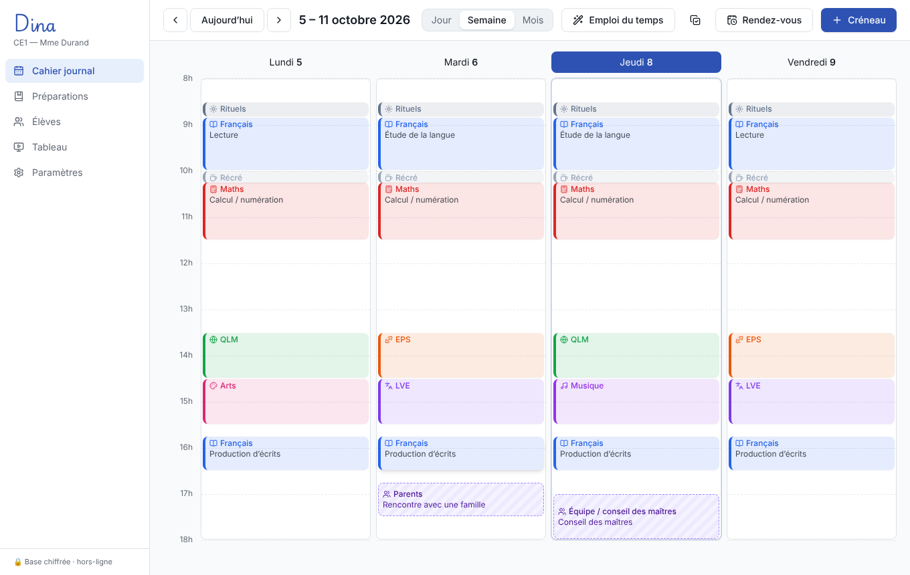
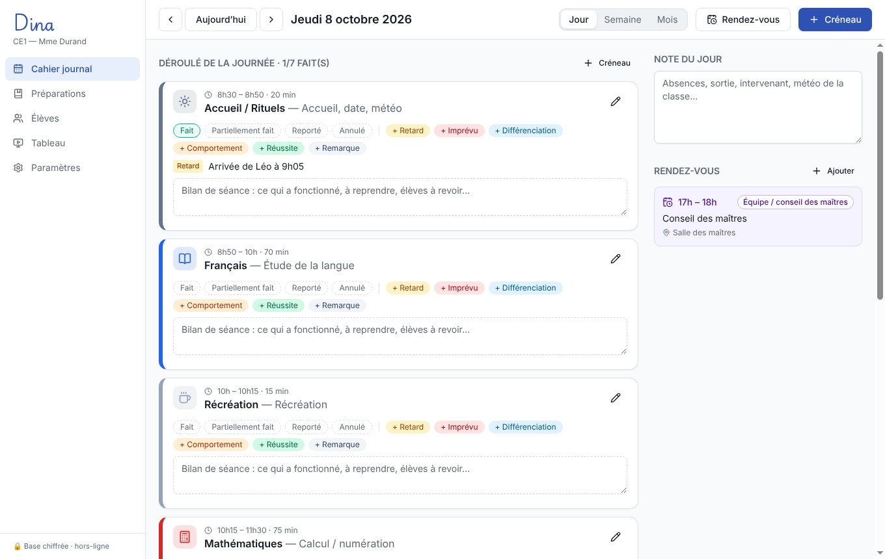
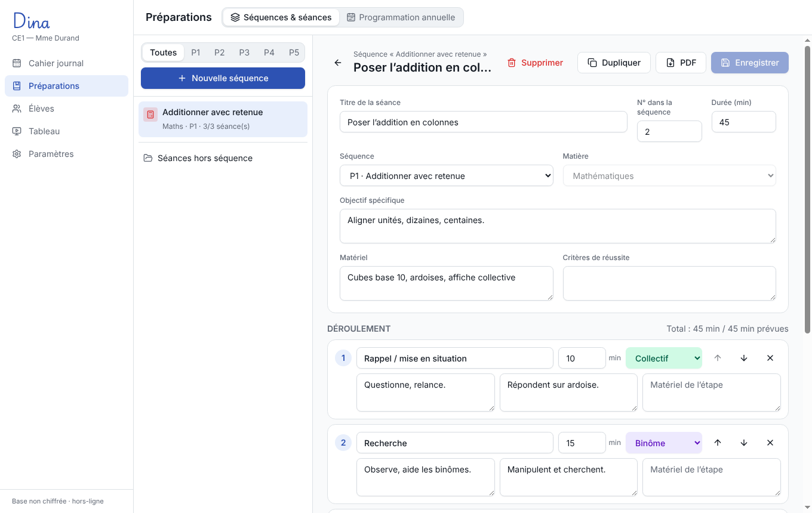
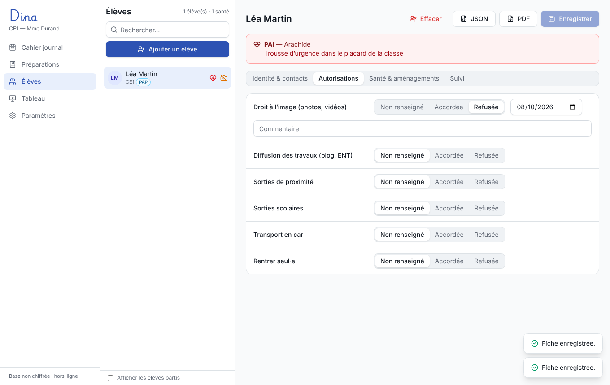

# Dina — cahier journal & tableau de classe hors-ligne

Application de bureau pour professeur·e des écoles (maternelle / élémentaire) :
cahier journal, emploi du temps, rendez-vous, préparations, fiches élèves et
mode tableau projeté avec écriture cursive sur lignage Seyès.

**100 % locale** : aucune connexion Internet, aucune télémétrie, base SQLite
chiffrée (SQLCipher / AES-256) sur le poste de l'enseignant·e.

| Cahier journal (semaine) | Journée : bilan et remarques en direct |
| --- | --- |
|  |  |
| **Pupitre du tableau (cursive sur Seyès)** | **Écran projeté : programme du jour** |
|  |  |
| **Fiche de préparation** | **Fiche élève** |
|  |  |

## Installer Dina (sans rien de technique)

1. Sur GitHub, ouvrez l'onglet **Actions**, cliquez sur la dernière exécution
   « Installeurs » marquée d'une coche verte.
2. En bas de la page, section **Artifacts**, téléchargez :
   - **Dina-Windows** : contient `Dina-Installation-….exe` (installation
     classique) et `Dina-Portable-….exe` (aucune installation, fonctionne depuis
     une clé USB, données rangées à côté du fichier) ;
   - **Dina-Mac** : `Dina-…-arm64.dmg` (Mac M1/M2/M3/M4) ou `Dina-…-x64.dmg`
     (Mac Intel) ;
   - **Dina-Linux** : `Dina-….AppImage`.
3. Décompressez le fichier `.zip` téléchargé puis lancez l'installeur.

Les installeurs ne sont pas signés (un certificat coûte plusieurs centaines
d'euros par an) ; le système affiche donc un avertissement la première fois :

- **Windows** : « Windows a protégé votre ordinateur » → *Informations
  complémentaires* → *Exécuter quand même*.
- **Mac** : clic droit sur Dina → *Ouvrir* → *Ouvrir* ; ou *Réglages système →
  Confidentialité et sécurité → Ouvrir quand même*.
- **Linux** : clic droit sur le fichier → *Propriétés* → autoriser l'exécution.

## Développement

Prérequis : Node.js 22+ (aucun compilateur nécessaire : le module SQLite
chiffré est livré précompilé pour Windows, macOS et Linux).

```bash
npm install
npm run dev        # application en mode développement (rechargement à chaud)
npm test           # tests de la couche données (exécutés dans le Node d'Electron)
npm run typecheck
npm run dist       # installeurs : .exe (NSIS + portable), .dmg, AppImage / .deb
```

Variables utiles :

- `DINA_DATA_DIR=/chemin` : dossier de données personnalisé.
- La version **portable** Windows range ses données à côté de l'exécutable
  (`Dina-donnees/`) : utilisable depuis une clé USB.

## Fonctionnalités

- **Base de données** : schéma complet de tous les modules, migrations
  versionnées (`PRAGMA user_version`), chiffrement optionnel avec changement /
  retrait du mot de passe, sauvegarde JSON compressée et chiffrée
  (AES-256-GCM + scrypt), restauration, export et effacement RGPD par élève.
- **Cahier journal** : vues jour / semaine / mois, créneaux par matière et
  domaine du socle, lien en un clic vers une fiche de séance, statut de séance
  (fait, partiel, reporté, annulé), remarques rapides (retard, imprévu,
  différenciation…), bilan, note du jour, rendez-vous (parents, RASED, équipe,
  ESS, conseil d'école) avec compte rendu, emploi du temps type
  (enregistrer une semaine / l'appliquer à une autre).
- **Mode tableau** : fenêtre de projection ouverte automatiquement sur l'écran
  secondaire, pilotée depuis un pupitre avec aperçu fidèle. Scènes : date du
  jour, consigne, programme en pictogrammes, minuteur visuel (disque qui se
  vide + carillon synthétisé), écran noir. Lignage Seyès ou double ligne,
  minuscules sur 1 ou 2 interlignes, polices cursive (Playwrite FR Moderne),
  script (Andika), capitales, OpenDyslexic, ou **police personnelle importée**
  (ex. Belle Allure, dont la licence interdit la redistribution).

- **Préparations** : programmation annuelle (matières × périodes P1 à P5,
  ordre = progression, dates des périodes), transformation d'une ligne de
  programmation en séquence, fiches séquence (objectifs, prérequis, critères de
  réussite, évaluation), fiches de préparation avec déroulement étape par étape
  (durée, modalité individuel / binôme / groupes / collectif, rôle de
  l'enseignant·e, activité des élèves, matériel), différenciation,
  institutionnalisation, duplication et **export PDF**.
- **Élèves** : fiche de renseignements (identité, contacts et responsables,
  autorisations photo / sorties / transport…, allergies et PAI, aménagements
  PAP / PPRE / PPS / tiers-temps), observations datées, historique des
  rendez-vous, alertes santé dans la liste, **export PDF** et **JSON** (droit
  d'accès) et **effacement définitif** (droit à l'effacement).

## Documentation

- [Architecture, choix techniques et schéma de données](docs/ARCHITECTURE.md)
