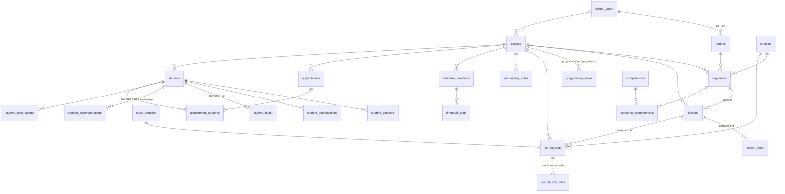

# Architecture

## 1. Choix de la pile : Electron plutôt que Tauri

Les deux conviennent ; **Electron** est retenu pour ce projet :

| Critère | Electron | Tauri |
| --- | --- | --- |
| Installation pour l'enseignant·e | Installeur ~90 Mo, rien d'autre à installer | Installeur ~8 Mo, mais dépend de WebView2 (Windows) / WebKitGTK (Linux) |
| Rendu identique partout | Chromium embarqué : la cursive, le lignage SVG et la projection s'affichent pareil sur tous les postes | Moteur du système : rendu variable (WebKit sur macOS / Linux) |
| Chiffrement SQLite | `better-sqlite3-multiple-ciphers` (SQLCipher), précompilé, API synchrone | Plugin SQL sans SQLCipher : il faut compiler une version chiffrée en Rust |
| Maintenance | Un seul langage (TypeScript) du stockage à l'interface | TypeScript + Rust |
| Multi-écrans / plein écran sur le projecteur | API `screen` et `BrowserWindow` mûres | Possible, moins documenté |

Le poids de l'installeur est le seul vrai inconvénient d'Electron ; pour un
poste d'école souvent verrouillé, l'absence de dépendance système (WebView2
parfois bloqué par l'administration) et la parité de rendu priment.

Pile : **Electron 44 · electron-vite · React 19 · TypeScript · Tailwind CSS 4 ·
composants façon shadcn/ui (Radix) · lucide-react · better-sqlite3-multiple-ciphers · Vitest.**

## 2. Processus et sécurité

```
┌────────────── processus principal (Node) ──────────────┐
│ DbManager ─ SQLite (SQLCipher)   ProjectionController   │
│ repositories/*  services/*       FontStore              │
│        ▲  ipcMain.handle (canaux typés, src/shared/ipc) │
└────────┼────────────────────────────────────────────────┘
         │ contextBridge (preload, liste blanche de canaux)
┌────────┴───────────┐        ┌──────────────────────────┐
│ Fenêtre principale │ ─────▶ │ Fenêtre de projection    │
│ (pupitre)          │ état   │ (#/projection, écran 2)  │
└────────────────────┘ diffusé└──────────────────────────┘
```

- `contextIsolation`, `sandbox`, pas de `nodeIntegration` ; le preload n'expose
  que `window.dina.invoke(canal, …)` limité à `CHANNELS`.
- **Zéro réseau** : toute requête non locale est annulée
  (`session.webRequest`), CSP `default-src 'self'`, aucune permission
  navigateur, correcteur orthographique désactivé (il téléchargerait des
  dictionnaires), pas de navigation ni de nouvelles fenêtres externes.
- Les erreurs IPC sont renvoyées sous forme `{ ok:false, error }` et affichées
  en notification.
- L'état du tableau vit dans le processus principal et est diffusé aux deux
  fenêtres ; le minuteur est décrit par une heure de fin absolue, ce qui garde
  pupitre et projection synchronisés sans échange continu.

## 3. Schéma de données

Fichier : `src/main/db/migrations/001_initial.ts`.



Principes :

- Dates `YYYY-MM-DD`, heures `HH:MM` (comparables en texte), contraintes
  `CHECK` sur les énumérations et sur `start_time < end_time`.
- **Effacement RGPD** : toutes les tables élèves dépendent de `students` en
  `ON DELETE CASCADE` ; `secure_delete = ON` écrase les pages libérées et un
  checkpoint WAL purge le journal. Les rendez-vous (événements de la classe)
  sont conservés, seul le lien vers l'élève disparaît.
- Les liens faibles (créneau → séance, observation → créneau) sont en
  `ON DELETE SET NULL` : supprimer une préparation n'efface jamais l'historique
  du cahier journal.
- Données de santé (catégorie particulière, art. 9) isolées dans
  `student_health`.

### Migrations

`migrate()` lit `PRAGMA user_version`, applique chaque migration manquante dans
sa propre transaction et refuse d'ouvrir une base plus récente que
l'application. Pour faire évoluer le schéma : ajouter
`src/main/db/migrations/00N_xxx.ts` et l'enregistrer dans `migrations/index.ts`,
sans jamais modifier une migration publiée.

## 4. Mode tableau : écriture cursive sur Seyès

`SeyesBoard` dessine en SVG :

- un interligne `u` = `unit_px × largeur / 1280` (l'aperçu et la projection
  ont donc le même découpage de lignes) ; grand carreau = `4u` ;
- la taille de police est calculée pour que la **hauteur d'x mesurée** de la
  police (canvas `measureText`) vaille exactement 1 ou 2 interlignes ;
- chaque ligne est posée avec `dominant-baseline="alphabetic"` sur une ligne
  d'écriture épaisse, ce qui garantit l'alignement quelle que soit la police.

Polices embarquées (licence SIL OFL) : Playwrite FR Moderne (cursive scolaire
française), Andika (script pensé pour l'apprentissage de la lecture),
OpenDyslexic. Belle Allure n'est pas redistribuable : chacun peut importer son
propre fichier, copié dans le dossier de données et chargé localement.

## 5. Export PDF

`pdf:export` reçoit un document HTML autonome (construit dans
`src/renderer/src/lib/printDocs.ts`, toutes les valeurs échappées), l'affiche
dans une fenêtre invisible **sans JavaScript** puis appelle
`webContents.printToPDF` : aucun service ni moteur externe.

## 6. Installeurs

`.github/workflows/installeurs.yml` vérifie (types + tests) puis fabrique les
installeurs sur Windows (NSIS + portable), macOS (dmg arm64 et x64) et Linux
(AppImage). Le module SQLite étant fourni précompilé (N-API) pour chaque
plate-forme, aucune recompilation n'est nécessaire (`npmRebuild: false`).
Pousser une étiquette `v0.2.0` publie en plus une Release GitHub.

## 7. Prochaines étapes

1. Bilan de séance → observations élèves en un clic depuis le cahier journal.
2. Impression du cahier journal (jour / semaine) et des programmations.
3. Calendrier des vacances par zone (saisie locale), préréglages de consignes
   (`board_presets`).
4. Signature des installeurs si l'application est diffusée plus largement.
